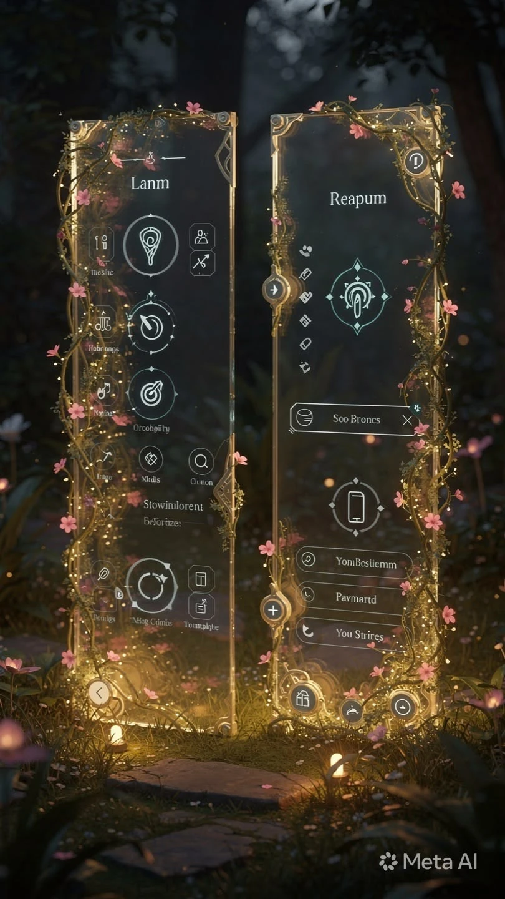
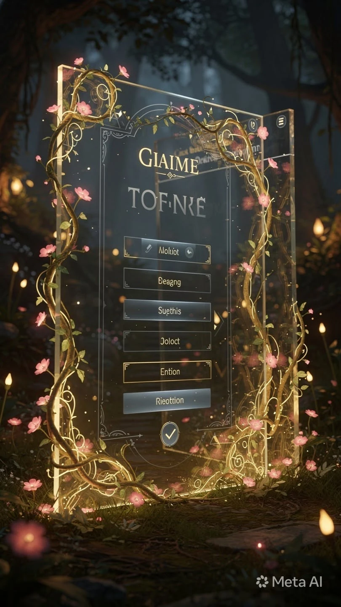

# Quest Sorceress — Art Direction

Derived from the reference images in `design/reference/`. This is the visual contract
for the build. Everything below is observable in those references, not invented.

---

## The idea in one line

**Enchanted glass panels floating in a moonlit forest** — frosted translucent cards held
in ornate gold frames, wrapped in living vines and cherry blossom, lit by drifting
bioluminescence.

## What the references establish

**The world.** A dark forest at night. Deep teal-greens and browns, heavy bokeh depth,
mossy ground, soft glowing orbs resting in the grass. The UI is not *on* a background —
it is standing *in* a place.

**The surface.** Every panel is frosted translucent glass. You can see the forest through
it, blurred. Panels float upright, with a faint drop shadow and a rim of light along
their edges.

**The frame.** Thin ornate gold borders with art-nouveau corner filigree — decorative
brackets at each corner rather than a plain rectangle.

**The vines.** Golden-brass vines with small leaves grow around the frame, asymmetrically.
They overlap the panel edge in places, so the plant reads as in front of the glass, not
printed on it. This is the single most characteristic element — without it the design is
just glassmorphism.

**The blossoms.** Pink cherry blossoms scattered along the vines. The only warm non-gold
colour, and the thing that keeps it from feeling austere. Used sparingly.

**The light.** Warm gold bioluminescence: floating motes, soft orbs, glow pooling at the
base of panels. Light comes from *within* the scene.

**The accent.** A cool mint-teal glow marks the active or primary element (see the
compass sigil in reference 1). It is the one cool colour in a warm scene, which is
exactly why it draws the eye. Use it for one thing at a time.

**The type.** Gold serif small-caps for titles, with generous letter-spacing. Light,
quiet sans for everything else. Titles are ornament; body text gets out of the way.

**The controls.** Circular gold-rimmed icon buttons. List rows as rounded rectangles with
a hairline gold border and frosted fill. Selected rows have a brighter gold border.

---

## Tokens

Starting values, to be refined against real screens.

| Token | Value | Use |
|---|---|---|
| `--forest-deep` | `#0B1210` | page ground, furthest depth |
| `--forest-mid` | `#16211C` | mid-ground foliage |
| `--glass` | `rgba(226, 240, 234, 0.07)` | panel fill |
| `--glass-edge` | `rgba(255, 249, 232, 0.22)` | panel rim light |
| `--gold` | `#C9A34E` | frames, vines, borders |
| `--gold-lit` | `#F0D695` | title text, highlights, glow |
| `--blossom` | `#E9A3B8` | cherry blossom |
| `--mint` | `#6FD8C0` | the single active/primary accent |
| `--text` | `#F2EDE1` | body text, warm off-white |
| `--text-dim` | `#A8B5AE` | secondary text |

**Blur:** panels use a real backdrop blur (~16–20px) so the forest shows through softened.
**Radius:** panels ~18px, list rows ~10px, icon buttons fully round.

## Type

- **Brand / wordmark:** **Pinyon Script** — ornate copperplate calligraphy, filled with
  a gold gradient (`background-clip: text`) and lit by two drop shadows: gold close in,
  blossom-pink further out. The pink is what ties the name to the vines. Used for every
  appearance of the app's name and nowhere else.
- **Display:** **Marcellus**, in `--gold-lit`. Quest titles and headings.
- **Body:** **Mulish**, light, generous line-height, in `--text`.

The wordmark carries the flourish so the rest of the interface does not have to. Quest
titles stay in Marcellus — calligraphy at body sizes is decoration pretending to be
information.

## Motion

Slow and ambient, never bouncy. Light motes drift upward. Panels fade and rise a little
on entry. The quest-complete animation should feel like something *blooming* — the
blossom and glow vocabulary is already there to borrow from.

Respect `prefers-reduced-motion`: keep the scene, stop the drift.

---

## Sound

Synthesised in the browser with the Web Audio API — no audio files, nothing to
license or download, and each cue tunable by ear.

**The voice:** bell-like. A fast attack, a long exponential decay, and a quieter
octave above detuned very slightly, which is what gives a struck bell its shimmer.
A short feedback delay suggests a space without the weight of a reverb impulse.

**The scale:** C major pentatonic — the 4th and 7th removed. With no semitones in
the set, no two notes landing together can sound sour, however they overlap.

**The progressions.** Every cue is a short progression, never a single beep:

| Cue | Shape | Notes |
|---|---|---|
| **Enter** (portal) | slow shimmer, two octaves | C4 · G4 · C5 · E5 · G5 · C6 · E6 over 1.1s |
| **Deal** (new quest) | three quick bright notes | E5 · G5 · C6, 70ms apart |
| **Complete** | the longest climb, with a sparkle | C5 · E5 · G5 · C6 · E6 · G6, settling on C6 |
| **Dismiss** | two soft steps down | A5 · D5 — courteous, not a buzzer |
| **Select** (a chip) | one short tap | A5 |
| **Unlock** (milestone) | the fullest flourish | C5 · G5 · C6 · D6 · G6 |

**Rules.** Rising for anything good. Dismissal falls, but gently — declining a
quest is a legitimate move, not a failure, and must never sound like one.
Completion is the brightest and longest sound in the app; nothing else should
compete with it.

**Browsers block audio before the first interaction**, so the very first portal of
a session may open in silence. One listener unlocks it, after which every later
cue sounds.

---

## Applying it to the screens

| Screen | Treatment |
|---|---|
| **Home** | One hero glass panel holding the current quest. "Give me a quest" is the primary action — the one element that gets the mint glow. Streak counter sits small and gold near the top. |
| **Quest Detail** | The same panel, enlarged. Complete and Dismiss as the two actions. |
| **Quest Preferences** | Frosted list rows with hairline gold borders; selected rows brighten, as in reference 2. |
| **Settings** | The quietest screen. Frame and glass, minimal vine. |
| **The passage** | One wide glass panel, filigree, no competing buttons. It is for reading. |

---

## What to avoid

- Vines as a flat printed border — they must overlap the panel edge and read as in front.
- Mint used on more than one element per screen; it stops being an accent.
- Pure black or pure white anywhere. The darkest value is forest, the lightest is warm.
- Heavy or bouncy animation. The scene is serene.
- Blossoms everywhere. They are punctuation, not texture.

---

## Note on the references

These are AI-generated concept images, so their UI text is nonsense and their layouts are
not literal screen designs. Take from them the **world, materials, palette, and framing** —
not the arrangement of controls. Section 4 of `SPEC.md` governs what is actually on each
screen.
